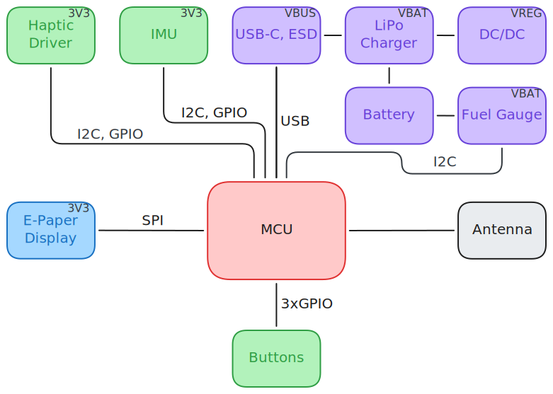
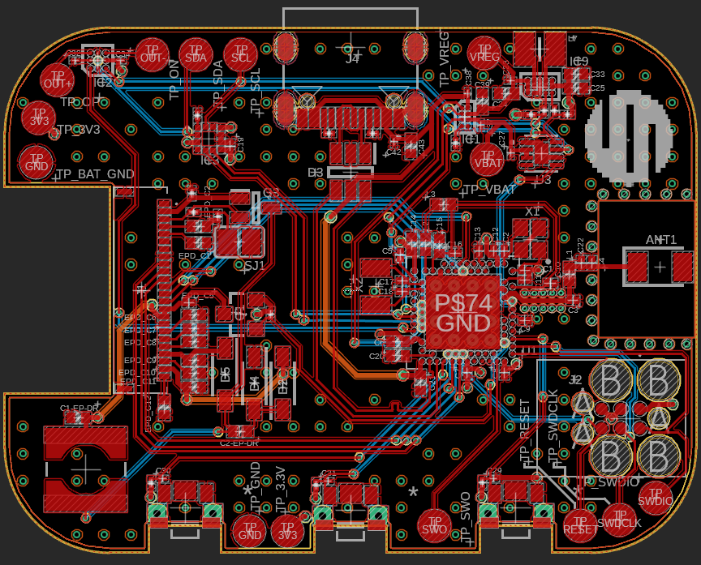
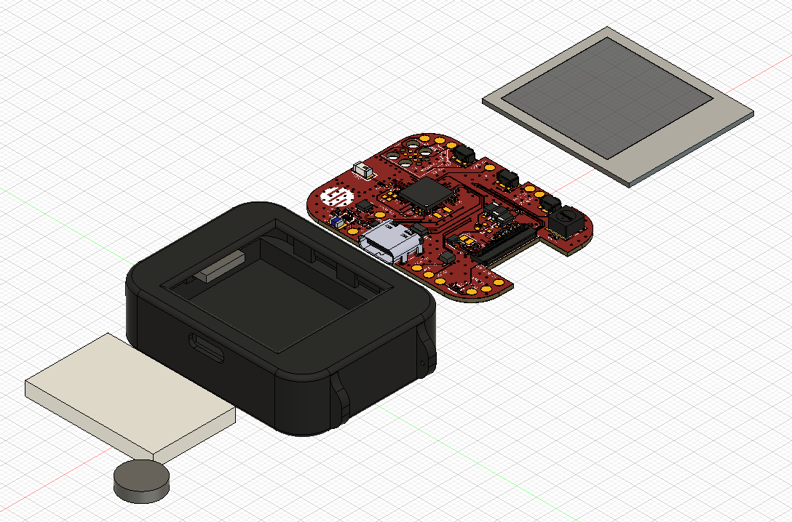

<!-- Copyright GOIDESCU Rareș-Ștefan 2026 -->

# InkTime

InkTime is a proper solution for the people that can't be bothered to charge their watch daily. This is a beginner's attempt at implementing it. Please see [the disclaimer and the license](#trademark-disclaimer) notice.

## Block Diagram

## Bill of Materials

| Part / Value | Refs | Qty | Procurement | Datasheet |
| :--- | :--- | :---: | :--- | :--- |
| **Active ICs & Semiconductors** | | | | |
| nRF52840-QFAA Microcontroller | U1 | 1 | [DigiKey](https://www.digikey.be/en/products/detail/nordic-semiconductor-asa/NRF52840-QFAA-F-R/15929812) | [DS](https://www.nordicsemi.com/Products/nRF52840) |
| BMA423 Triaxial Accelerometer | IC3 | 1 |[Mouser 262-BMA423](https://eu.mouser.com/ProductDetail/Bosch-Sensortec/BMA423?qs=HXFqYaX1Q2xC%252BSgeGoX3mg%3D%3D) | [DS](https://watchy.sqfmi.com/assets/files/BST-BMA423-DS000-1509600-950150f51058597a6234dd3eaafbb1f0.pdf) |
| BQ25180YBGR Li-Ion Charger | IC1 | 1 |[Mouser 595-BQ25180YBGR](https://eu.mouser.com/ProductDetail/Texas-Instruments/BQ25180YBGR?qs=doiCPypUmgEWjAK%252BJAX6Tw%3D%3D) | [DS](https://www.ti.com/product/BQ25180) |
| DRV2605YZFR Haptic Driver | IC2 | 1 | [Mouser](https://eu.mouser.com/ProductDetail/Texas-Instruments/DRV2605YZFR?qs=9Zb5cNRUa0Ym539PjgFm3g%3D%3D) | [DS](https://www.ti.com/product/DRV2605) |
| MAX17048G+T10 Fuel Gauge | U3 | 1 | [DigiKey](https://www.digikey.com/en/products/detail/analog-devices-inc-maxim-integrated/MAX17048G-T10/3758921) | [DS](https://www.analog.com/en/products/max17048.html) |
| RT6160AWSC Buck-Boost DC-DC | IC9 | 1 |[Mouser 835-RT6160AWSC](https://eu.mouser.com/ProductDetail/Richtek/RT6160AWSC?qs=amGC7iS6iy%2FLd9PSoixZXQ%3D%3D) | [DS](https://www.richtek.com/Products/Switching%20Regulators/Buck-Boost%20Converter/RT6160A) |
| USBLC6-2SC6Y ESD Protection | D3 | 1 | [DigiKey](https://www.digikey.com/en/products/detail/stmicroelectronics/USBLC6-2SC6Y/2819177) | [DS](https://www.st.com/en/protections-and-emi-filters/usblc6-2.html) |
| MBR0530 Schottky Diode | D2, D4, D5 | 3 | [Mouser](https://eu.mouser.com/c/semiconductors/discrete-semiconductors/diodes-rectifiers/schottky-diodes-rectifiers/?m=onsemi&series=MBR0530) | [DS](https://www.onsemi.com/pdf/datasheet/mbr0530t1-d.pdf) |
| DMG2305UX-7 P-CH MOSFET 20V/4.2A | Q1 | 1 | [Mouser](https://ro.mouser.com/ProductDetail/Diodes-Incorporated/DMG2305UX-7?qs=L1DZKBg7t5F%2FNBHrjfxC%252Bg%3D%3D) | [DS](https://www.diodes.com/assets/Datasheets/DMG2305UX.pdf) |
| SI1308EDL-T1-GE3 N-CH MOSFET 30V/1.5A | Q3 | 1 | [Mouser](https://eu.mouser.com/ProductDetail/Vishay-Semiconductors/SI1308EDL-T1-GE3?qs=bX1%252BNvsK%2FBramh9tgpOaEw%3D%3D) |[DS](https://www.vishay.com/docs/63399/si1308edl.pdf) |
| **Connectors & Electromechanical** | | | | |
| 2450AT18B100E 2.45 GHz Antenna | ANT1 | 1 | [Mouser 609-2450AT18B100E](https://www.mouser.co.uk/ProductDetail/Johanson-Technology/2450AT18B100E?qs=yCnrNFeXz%252Bh5MFsFIXGZGA%3D%3D) | [DS](https://www.johansontechnology.com/datasheets/2450AT18B100/2450AT18B100.pdf) |
| 503480-2400 24-pin FPC 0.5 mm | J1 | 1 |[Mouser 538-503480-2400](https://eu.mouser.com/ProductDetail/Molex/503480-2400?qs=OAhjpuo3Vu7efIoxFh9AOw%3D%3D) | [DS](https://www.molex.com/en-us/products/part-detail/5034802400?display=pdf) |
| KH-TYPE-C-16P USB Type-C 16-pin | J4 | 1 | [xonelec.com](https://www.xonelec.com/mpn/kinghelm/khtypec16p) | [DS](https://xonstorage.z8.web.core.windows.net/pdf/kinghelm_khtypec16p_xonjuly20_20_link.pdf) |
| TC2030-IDC 6-pin Debug Adapter | J2 | 1 | [Tag-Connect](https://www.tag-connect.com/product/tc2030-idc-6-pin-tag-connect-plug-of-nails-spring-pin-cable-with-legs) | [DS](https://www.tag-connect.com/wp-content/uploads/bsk-pdf-manager/2019/12/TC2030-IDC-Datasheet-Rev-B.pdf) |
| EVP-AKE31A Tactile Button | SW_DN, SW_ENT, SW_UP | 3 |[Mouser](https://eu.mouser.com/ProductDetail/Panasonic/EVP-AKE31A?qs=EU6FO9ffTwe%252BJzX5LvvHqA%3D%3D) | [DS](https://www.tme.eu/Document/7d6137f818fadb8daa876cedb29b6731/EVPAKseries.pdf) |
| **Inductors** | | | | |
| FTC252012SR47MBCA 0.47 µH | L7 | 1 |[LCSC C5832368](https://www.lcsc.com/product-detail/C5832368.html) | [DS](https://www.lcsc.com/datasheet/C5832368.pdf?spm=wm.sxq.inf.ggs&lcsc_vid=RAVWAlZRTgINBlwCQQJeUgdVT1VdUFFeE1EIVAJWFVYxVlNRQVZcVFJRQFFZUzsOAxUeFF5JWBYZEEoBGA4JCwFIFA4DSA%3D%3D) |
| 744043680 68 µH | L5 | 1 |[Mouser](https://eu.mouser.com/ProductDetail/Wurth-Elektronik/744043680?qs=PGXP4M47uW6VkZq%252BkzjrHA%3D%3D) | [DS](https://www.we-online.com/katalog/datasheet/744043680.pdf) |
| **Passives** | | | | |
| 12 pF 0201 (HFXO/LFXO load caps) | C1, C2, C17, C18 | 4 | Generic 0201 | - |
| 100 nF 0201 decoupling | C5, C7, C8, C12, C19 | 5 | Generic 0201 | - |
| 1 µF 0201[GRM011R60J152KE01L](https://www.snapeda.com/parts/GRM011R60J152KE01L/Murata/view-part/) | C29–C32, C37, C38 | 6 | Murata / Mouser | - |
| 0.1 µF 0201[GRM011R60J152KE01L](https://www.snapeda.com/parts/GRM011R60J152KE01L/Murata/view-part/) | C23, C27, C34, C42 | 4 | Murata / Mouser | - |
| 10 µF 0402 | C24, C39, C1-EP-DR | 3 | Generic 0402 | - |
| 22 µF 0402 | C25, C33 | 2 | Generic 0402 | - |
| 1 µF/50V 0402 (EPD drive) | EPD_C1/2/6–12 | 9 | Generic 0402 | - |
| 3.3 kΩ 0201 (I2C pull-ups) | R17, R18 | 2 | Generic 0201 | - |
| 5.1 kΩ 0201 (USB CC) | R1_USB, R2_USB | 2 | Generic 0201 | - |
| 10 kΩ 0201 (button pull-ups, misc) | R5, R7, R8, R9, R2_EP_DR, R_PWR_EPD | 6 | Generic 0201 | - |
| 0 Ω 0201 (DNP jumpers) | R2, R3, R4 | 3 | Generic 0201 | - |

## Hardware Description

### Power Management

**BQ25180YBGR** charges the LiPo from USB (5V). `PMIC_INT` alerts the MCU to faults and status changes. Q1 provides reverse-polarity protection on the VBUS path.

**RT6160AWSC** generates the 3V3 rail via a buck-boost topology, required because battery voltage (3V–4V2) straddles the 3V3 output. Switching node uses an inductor; output is filtered by capacitors. Controlled via I2C and a GPIO enable pin.

**MAX17048G+T10** estimates battery SoC over I2C using the ModelGauge algorithm, eliminating the need for a power-wasting current-sense resistor. The `ALERT` pin fires when the SoC drops below a configurable threshold.

**MBR0530 diodes** (D2, D4, D5) are arranged to steer power between USB, the battery, and the EPD drive rail to prevent back-feeding across power domains.

### Microcontroller

64 MHz Cortex-M4F, 1 MB Flash, 256 KB RAM, Bluetooth 5.0 LE, USB 2.0 FS. Peripherals used:

- **Power** - The internal DC-DC regulator is enabled via dedicated LC matching to step down the 3V3 rail internally, drastically reducing the active power footprint of the CPU and radio.
- **SPIM3** - E-Paper display (MOSI, SCK + 4 control GPIOs)
- **TWIM0** - shared I2C bus (BMA423, BQ25180, MAX17048, DRV2605, RT6160A)
- **USB** - firmware update / serial via dedicated D+/D− pads through USBLC6 ESD protection
- **RTC0** - timekeeping in sleep, clocked from 32.768 kHz LFXO
- **Radio** - Bluetooth LE for phone time sync

### Clocks

- X1 (32 MHz) - HFXO for CPU and radio. 12 pF load caps C1, C2 placed adjacent.
- X2 (32.768 kHz) - LFXO for RTC. Pins P0.00/XL1 and P0.01/XL2. 12 pF load caps C17, C18.

### Antenna

The 2450AT18B100E chip antenna sits at the board edge with the full copper/trace keep-out zone underneath per the datasheet.
It connects via a matching network.

### Display (SPI)

Molex 503480-2400 24-pin 0.5 mm FPC connector (J1) on the left board edge.
Interface: MOSI, SCK, EPD_CS, EPD_DC, EPD_RST, EPD_BUSY over SPIM3.
The on-board boost drive circuit generates the positive and negative high-voltage rails needed for pixel switching.
SJ1 solder jumper selects the EPD panel variant.

### IMU (I2C)

Step counting, tilt, tap detection, etc.

### Haptics (I2C)

DRV2605YZFR ERM/LRA haptic driver for physical notification feedback.

### Buttons

Three EVP-AKE31A side-entry tactile switches. Debounced via hardware using capacitors (C29–C32 series) and 10 kΩ pull-ups (R5, R7, R8) to ensure clean interrupts waking the MCU from deep sleep.

### Debug Interface

Tag-Connect 6-pin pogo footprint (J2). Signals: SWDIO, SWDCLK, SWO, RESET, VCC, GND.

## nRF52840 Pin Assignment

| Pin | Net | Peripheral | Notes |
| :--- | :--- | :--- | :--- |
| P0.00/XL1 | `XL1` | Crystal X2 | 32.768 kHz LFXO in |
| P0.01/XL2 | `XL2` | Crystal X2 | 32.768 kHz LFXO out |
| XC1, XC2 | `XC1`, `XC2` | Crystal X1 | 32 MHz HFXO |
| P0.06 | `SDA` | IC1, IC2, IC3, U3, IC9 | I2C |
| P0.07 | `SCL` | IC1, IC2, IC3, U3, IC9 | I2C |
| P0.08 | `IMU_INT1` | IMU (BMA421)	Interrupt 1 |
| P0.11	| `PMIC_INT` | LiPo Charger | Fault interrupt |
| P0.12	| `HAPTIC_EN`	| Haptics | Haptics enable |
| P0.13 | `P0.13` | SW_UP | Button |
| P0.14 | `P0.14` | SW_ENT | Button |
| P0.15	| `EPD_DC` | Display D/C |
| P0.16	| `EPD_RST` | Display reset |
| P0.17 | `EPD_BUSY` | Display | Busy status |
| P0.18/RESET | `RESET` | TC2030 J2, pull-up | system reset |
| SWDCLK | `SWDCLK` | TC2030 J2 | SWD clock |
| SWDIO | `SWDIO` | TC2030 J2 | SWD data |
| P1.00 | `SWO` | TP | SWO trace output |
| P1.02 | `P1.02` | SW_DN | Button |
| P1.08 | `IMU_INT2` | IMU | Interrupt 2 |
| P1.10 | `ALERT` | Fuel Gauge | SoC alert |
| D+ | `D+` | USB-C J4 via D3 | USB FS data + |
| D− | `D−` | USB-C J4 via D3 | USB FS data − |
| VBUS | `VBUS` | J4 / R1_USB+R2_USB divider | 5 V bus |
| ANT |	`RF` | 2.4 GHz antenna | Antenna feed |

## Power Consumption Estimates

| Mode | Dominant consumers | Est. current | Battery life (300 mAh) |
| :--- | :--- | ---: | ---: |
| Deep sleep (Static display, BLE off) | nRF52840 RTC + BMA423 sleep + MAX17048 + quiescent ICs | ~120 µA | ~104 days |
| Active (1 EPD refresh/min + BLE adv) | CPU active + Radio TX/RX + EPD boost circuit averaged | ~5–6 mA | ~50 hours |
| Mixed realistic use | Mostly deep sleep, periodic wake on wrist gesture / button press | - | **~7–14 days** |

## Design Logs

- Had to manually approve via in pad overlaps.
- Had to apply neck down to some segments of the power routes, reducing the width to 0.2675 mm (from 0.3 mm).
- Matched lenght for differential lines and symmetric configurations for the crystals.

## PCB Renders

### Top Layer

### Bottom Layer

## Exploded View

## Trademark Disclaimer

This project includes a reproduction of the Viltrumite logo on the PCB silkscreen.

- The Viltrumite logo is trademark of Image Comics and/or its creators.
- This project is non-commercial and is not affiliated with, endorsed by, or sponsored by Image Comics or the Invincible franchise.
- The [CERN-OHL-S v2.0](LICENSE) license governs the electronic design files only and does not grant any rights to the Viltrumite trademark or associated artwork.